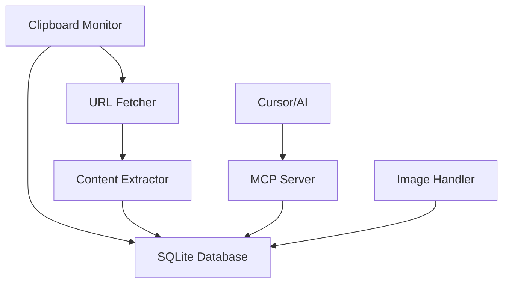

# 📋 clipboard-mcp

> **An intelligent clipboard companion for AI assistants**

Transform your clipboard into a powerful, searchable knowledge base that your AI can access and leverage. This enhanced Model Context Protocol (MCP) server turns simple copy-paste operations into a rich, persistent data source for smarter AI interactions.

<div align="center">


</div>

## 🌟 What is clipboard-mcp?

**clipboard-mcp** is an enhanced MCP server that makes your clipboard intelligent and accessible to AI assistants like Claude in Cursor IDE. Instead of just basic copy-paste, it provides:

- **🧠 Smart History**: Every copied item is automatically saved and categorized
- **🔍 Instant Search**: Find any previously copied text, URL, or image instantly  
- **🌐 URL Intelligence**: Automatically fetches and extracts content from copied links
- **📊 Usage Analytics**: Track your clipboard patterns and most-used content
- **🖼️ Image Support**: Handle copied images with full metadata
- **⚡ Real-time**: Background monitoring with zero user intervention required

## 🎯 Use Cases

### For Developers
- **Code Snippet Library**: Build a searchable database of copied code snippets
- **API Research**: Copy API docs URLs and have full content available to your AI
- **Debug History**: Keep track of error messages and stack traces you've copied
- **Documentation Mining**: Extract and organize information from various sources

### For Researchers & Writers  
- **Research Collection**: URLs you copy are automatically fetched and full-text indexed
- **Quote Database**: Search through previously copied text passages
- **Reference Management**: Build a knowledge base from copied academic content
- **Content Curation**: Organize and retrieve copied content by topic or type

### For AI-Assisted Workflows
- **Context Building**: Your AI can access your entire clipboard history for better context
- **Dynamic References**: AI can pull in previously copied URLs, code, or text mid-conversation
- **Pattern Recognition**: AI can identify useful patterns in your clipboard usage
- **Smart Suggestions**: Based on clipboard history, AI can suggest relevant past content

## ✨ Features

### 🔧 Core Clipboard Operations
| Tool | Description |
|------|-------------|
| `get_clipboard_contents` | Get current clipboard content |
| `copy_to_clipboard` | Copy text to clipboard |
| `get_clipboard_info` | Detailed clipboard metadata with URL detection |

### 📚 Enhanced History & Intelligence  
| Tool | Description |
|------|-------------|
| `search_clipboard_history` | Full-text search through clipboard history |
| `get_recent_clipboard_entries` | Recent items with smart filtering |
| `get_clipboard_entry` | Retrieve specific entry with full metadata |
| `get_url_entries` | URLs with automatically fetched content |
| `get_clipboard_stats` | Usage analytics and database insights |

### 🚀 Advanced Capabilities

- **🗄️ SQLite Persistence**: Local database stores everything securely
- **🌐 Intelligent URL Processing**: Auto-fetches titles, descriptions, and full content
- **🖼️ Image Handling**: Supports copied images with size and format detection  
- **🔍 Powerful Search**: Find content across text, URLs, titles, and descriptions
- **📊 Usage Analytics**: Track patterns and frequently used content
- **⚡ Background Monitoring**: Automatic real-time clipboard monitoring
- **🔒 Privacy-First**: All data stored locally, no cloud dependencies

## 🚀 Quick Start

### Installation

```bash
# Clone the repository
git clone https://github.com/samhann/clipboard-mcp.git
cd clipboard-mcp

# Install with dependencies
pip install -e .
```

### Running the Server

```bash
# Using the startup script (recommended)
./scripts/run-server-quiet.sh

# Or directly with Python
python -m clipboard_mcp.server

# Or using the console script
clipboard-mcp
```

### Testing Everything Works

```bash
# Run comprehensive tests
./scripts/test-server.sh

# Test specific functionality
python tests/test_enhanced_clipboard.py
```

## 🔧 Cursor IDE Integration

Add this MCP server to Cursor for seamless AI integration:

### Step 1: Configuration

Create or edit `~/.cursor/mcp.json`:

```json
{
  "mcpServers": {
    "clipboard-mcp": {
      "command": "/absolute/path/to/clipboard-mcp/scripts/run-server-quiet.sh",
      "args": []
    }
  }
}
```

### Step 2: Verify Setup

1. **Restart Cursor** completely
2. **Go to Settings** → MCP Servers  
3. **Look for green indicator** next to "clipboard-mcp"
4. **Verify "8 tools enabled"** appears

### Step 3: Start Using

Once configured, your AI can:

```
Ask: "What URLs have I copied recently?"
Ask: "Search my clipboard history for 'API key'"
Ask: "What's the most recent code I copied?"
Ask: "Show me clipboard statistics"
```

## 📖 Detailed Usage

### Automatic Background Monitoring

The server automatically monitors your clipboard and:
- **Detects URLs** and fetches their content in the background
- **Handles images** copied from screenshots or image files  
- **Deduplicates content** to avoid storing the same thing twice
- **Tracks usage** for analytics and optimization

### Smart URL Processing

When you copy a URL like `https://docs.python.org/3/library/json.html`:

1. **Immediate Storage**: URL is saved to history
2. **Background Fetch**: Page content is downloaded asynchronously  
3. **Content Extraction**: Title, description, and main text extracted
4. **Search Integration**: All content becomes searchable
5. **AI Access**: Your AI can reference the full page content

### Database Location

All data is stored locally in:
```
~/.clipboard-mcp/clipboard_history.db
```

## 🏗️ Architecture



## 🔧 Configuration Options

### Alternative Cursor Configurations

**Using Python directly:**
```json
{
  "mcpServers": {
    "clipboard-mcp": {
      "command": "/path/to/venv/bin/python",
      "args": ["-m", "clipboard_mcp.server"],
      "env": {
        "PYTHONPATH": "/path/to/clipboard-mcp/src"
      }
    }
  }
}
```

**Using uv package manager:**
```json
{
  "mcpServers": {
    "clipboard-mcp": {
      "command": "uv", 
      "args": ["run", "--directory", "/path/to/clipboard-mcp", "python", "-m", "clipboard_mcp.server"]
    }
  }
}
```

## 🧪 Testing

### Quick Validation
```bash
# Test server response
echo '{"jsonrpc":"2.0","id":1,"method":"initialize","params":{"protocolVersion":"2024-11-05","capabilities":{"tools":{}}}}' | ./scripts/run-server-quiet.sh
```

### Comprehensive Testing
```bash
# Full test suite with database, URL fetching, and MCP protocol
./scripts/test-server.sh
```

### Manual Testing
```bash
# Test individual components
python tests/test_enhanced_clipboard.py
```

## 📊 Example AI Interactions

Once configured, you can have conversations like:

**🔍 Search & Discovery:**
```
You: "Find all the GitHub URLs I've copied this week"
AI: Uses search_clipboard_history and get_url_entries to find and display GitHub URLs with their repo descriptions

You: "What was that error message I copied earlier?"  
AI: Searches clipboard history for recent text entries containing error patterns
```

**📚 Knowledge Retrieval:**
```
You: "I copied a Stack Overflow link about async/await - what did it say?"
AI: Finds the URL entry and displays the full fetched content

You: "Show me all the API documentation I've collected"
AI: Filters URL entries for documentation sites and shows titles/descriptions
```

**📈 Analytics & Insights:**
```
You: "What do I copy most often?"
AI: Uses get_clipboard_stats to show usage patterns

You: "How much clipboard data do I have stored?"
AI: Displays database statistics and storage information
```

## 🛠️ Development

### Project Structure
```
clipboard-mcp/
├── src/clipboard_mcp/           # Main source code
│   ├── server.py               # MCP server implementation  
│   ├── database.py             # SQLite operations
│   ├── monitor.py              # Clipboard monitoring
│   ├── url_fetcher.py          # URL content extraction
│   └── schema.sql              # Database schema
├── scripts/                    # Utility scripts
│   ├── run-server-quiet.sh     # Production server launcher
│   └── test-server.sh          # Test runner
├── tests/                      # Comprehensive test suite
└── docs/                       # Documentation
```

### Dependencies

**Core:**
- `pyperclip` - Cross-platform clipboard access
- `aiosqlite` - Async SQLite operations  
- `aiohttp` - Async HTTP client for URL fetching
- `beautifulsoup4` - HTML content extraction
- `pillow` - Image processing (optional)

**Development:**
- `pytest` + `pytest-asyncio` - Testing framework
- `black`, `isort`, `flake8` - Code formatting and linting

## 🤝 Contributing

1. **Fork the repository**
2. **Create a feature branch**: `git checkout -b feature/amazing-feature`
3. **Make your changes** and add tests
4. **Run the test suite**: `./scripts/test-server.sh`
5. **Submit a pull request**

## 📝 Troubleshooting

### Common Issues

| Issue | Solution |
|-------|----------|
| "0 tools enabled" in Cursor | Check absolute paths in config, restart Cursor |
| Database errors | Delete `~/.clipboard-mcp/clipboard_history.db` to reset |
| Import errors | Ensure virtual environment activated: `source venv/bin/activate` |
| URL fetching fails | Check network connectivity, some sites block automated requests |

### Debug Mode

Enable verbose logging:
```bash
# Set environment variable before running
export CLIPBOARD_MCP_DEBUG=1
./scripts/run-server-quiet.sh
```

## 📄 License

MIT License - see [LICENSE](LICENSE) file for details.

## 🙏 Acknowledgments

- Built on the [Model Context Protocol](https://modelcontextprotocol.io/) standard
- Inspired by the need for smarter AI-human interaction workflows
- Designed for seamless integration with [Cursor IDE](https://cursor.sh/)

---

<div align="center">

**[⭐ Star this repo](https://github.com/samhann/clipboard-mcp)** if you find it useful!

Made with ❤️ for the AI-assisted development community

</div>